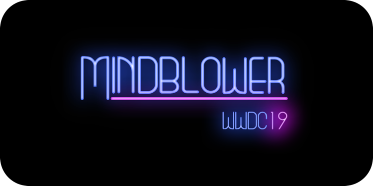

## Introduction 👋
This playground is a submission for the WWDC19 Scholarship and consists of a game called Mindblower, where the player shoots sticky grenades — which are affected by vector fields — in order to blow minds. To achieve this objective, the player needs to analyse each level, come up with a plan and shoot precisely.

## More
- This [article on Medium](https://medium.freecodecamp.org/how-i-won-a-scholarship-to-apples-yearly-event-for-the-second-time-f04f5f4636b1) covers the entire process behind the development of this playground.
- The game is also available on the [App Store](https://itunes.apple.com/us/app/mindblower-the-game/id1460079689?mt=8).
- There is a [playthrough video on Youtube](https://www.youtube.com/watch?v=xH9cn7BtG8k).

## Credits
- "Paradise" by Juno Dreams
- The guy at Apple behind the phrase "Write code. Blow minds."
